# 🧠 DAGScanner Backend Oracle

[](https://www.python.org/)
[](https://www.djangoproject.com/)
[](https://www.django-rest-framework.org/)

This repository contains the backend service for DAGScanner. It functions as a secure, stateless, **off-chain analysis oracle**. Its sole responsibility is to perform machine learning-based prediction trust score analysis on smart contract addresses and return the results to a client.

This backend is intentionally decoupled from the blockchain. It does not hold private keys, manage nonces, or send transactions, which significantly enhances security and simplifies its architecture.

---

## 🏛️ Architectural Overview

The DAGScanner ecosystem follows a modern, decentralized Web3 pattern. The backend avoids acting as a centralized transaction relayer. Instead, it provides the "intelligence," and the user's client handles the "action."

**Data Flow:**

1.  **Frontend → Backend:** The frontend sends a contract address to this API.
2.  **Backend (Oracle):** This service runs a pre-trained ML Prediction model to calculate a `score` and `status`. It then returns this data to the frontend.
3.  **Frontend → Smart Contract:** The frontend uses the data from this API to construct a transaction, which the user then signs and sends to the BlockDAG smart contract, paying the required fee.

```mermaid
sequenceDiagram
    participant User
    participant Frontend (React)
    participant Backend (This Repo)
    participant Smart Contract (BlockDAG)

    User->>+Frontend: Enters contract address & clicks "Analyze"
    Frontend->>+Backend: POST /api/analyze/ with {"address": "0x..."}
    Backend->>Backend: Mock feature extraction + Run ML model
    Backend-->>-Frontend: Returns {"score": 85, "status": "Safe ✅"}
    Frontend->>+User: Prompts to sign transaction with analysis data
    User->>User: Signs with MetaMask
    User-->>-Smart Contract: Sends transaction (storeResultAndPay) with fee
    Smart Contract->>Smart Contract: Stores result on-chain
```



---

## ✨ Features

- **Stateless Oracle:** Receives an address, returns a Prediction analysis. No session or user data is stored.
- **Secure by Design:** No private keys or "hot wallets" on the server. All transaction signing is client-side.
- **ML-Powered:** Utilizes a pre-trained `scikit-learn` model to predict a contract's trust score.
- **Robust & Scalable:** Built with Django and Django REST Framework for production-ready performance.
- **Ready for Deployment:** Configured for production environments like Render

---

## 🚀 Getting Started (Local Development)

Follow these instructions to get the backend running on your local machine for development and testing.

### 1. Prerequisites

- [Python 3.10+](https://www.python.org/downloads/)
- `pip` and `venv`

### 2. Clone & Setup

```bash
# Clone the repository
git clone https://github.com/your-username/dagscanner-backend.git
cd dagscanner-backend

# Create and activate a virtual environment
python -m venv venv
source venv/bin/activate  # On Windows, use `venv\Scripts\activate`

# Install the required dependencies
pip install -r requirements.txt
```

### 3. Environment Configuration

This project uses a `.env` file to manage environment variables.

1.  Create a `.env` file in the project root by copying the example:

    ```bash
    cp .env.example .env
    ```

2.  Open the `.env` file and set the `SECRET_KEY`.
    ```ini
    # .env - Local Environment Variables
    # This key is for local development only. Generate a new one for production.
    SECRET_KEY='django-insecure-your-random-local-key'
    DEBUG=True
    ```

### 4. Run the Server

With the virtual environment activated, run the Django development server:

```bash
python manage.py runserver
```

The API will now be available at `http://127.0.0.1:8000/`.

---

## 🔧 API Documentation

The backend exposes a single, powerful endpoint.

### `POST /api/analyze/`

Performs an off-chain trust score analysis of a given smart contract address.

#### Request Body

```json
{
  "address": "0xd8dA6BF26964aF9D7eEd9e03E53415D37aA96045"
}
```

| Field     | Type     | Description                             | Required |
| :-------- | :------- | :-------------------------------------- | :------- |
| `address` | `string` | The 0x-prefixed smart contract address. | Yes      |

#### Success Response (`200 OK`)

```json
{
  "address": "0xd8dA6BF26964aF9D7eEd9e03E53415D37aA96045",
  "score": 95,
  "status": "Safe ✅"
}
```

#### Error Response (`400 Bad Request`)

```json
{
  "error": "A valid contract address starting with '0x' is required."
}
```

---

## 🧪 Testing the Endpoint

You can use any API client like [Thunder Client (VS Code)](https://www.thunderclient.com/) or [Postman](https://www.postman.com/) to test the endpoint.

- **Method:** `POST`
- **URL:** `http://127.0.0.1:8000/api/analyze/`
- **Body:** `JSON` (use the request body format above)

---

## ☁️ Deployment

This application is configured for easy deployment on platforms like [Render](https://render.com/).

1.  **Prepare your project:**

    - Ensure `gunicorn`, `dj-database-url`, and `psycopg2-binary` are in your `requirements.txt`.
    - Push your code to a GitHub repository.

2.  **Create a new "Web Service" on Render:**

    - **Build Command:** `pip install -r requirements.txt && python manage.py collectstatic --no-input && python manage.py migrate`
    - **Start Command:** `gunicorn dag_surety_project.wsgi` (replace `dag_surety_project` with your project name).

3.  **Add Environment Variables in the Render UI:**
    - `SECRET_KEY`: _Generate a new, strong secret key for production._
    - `DEBUG`: `False`

The backend does **not** require any blockchain-related secrets (`RPC_URL`, `PRIVATE_KEY`, etc.), making deployment simple and secure.
